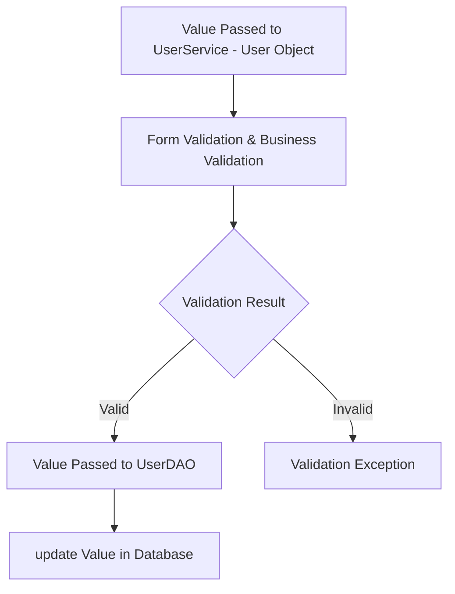
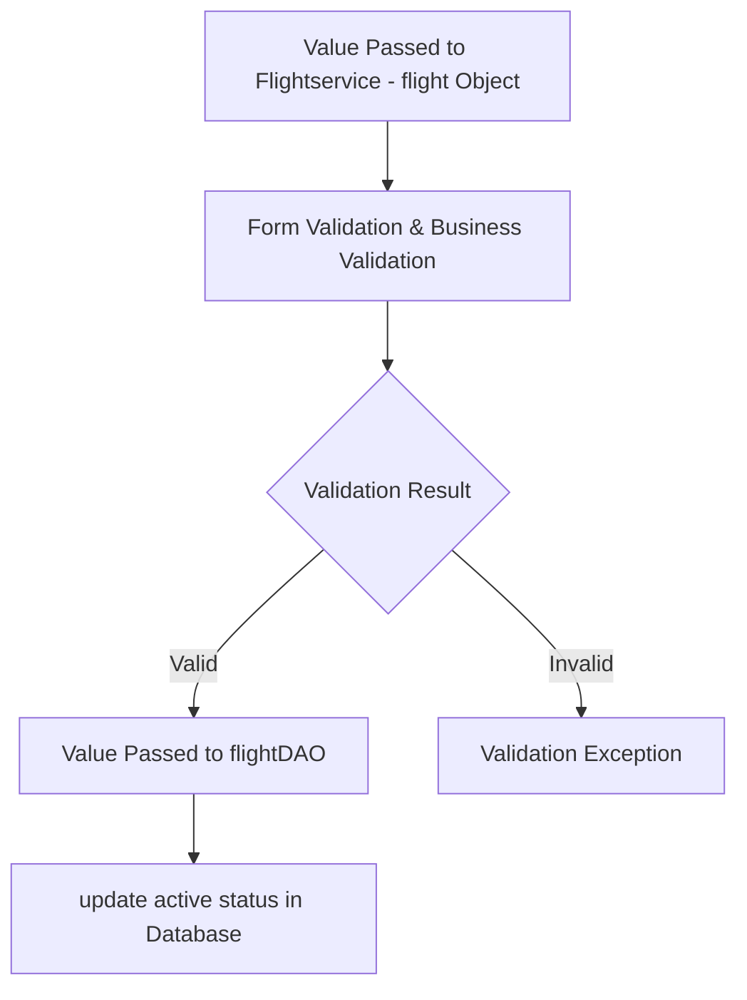
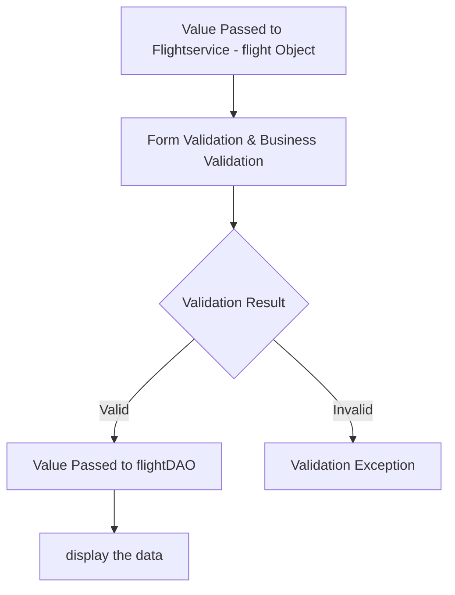

# Aviease

## Database Design
- [ ] Write Create table scripts [script](src/main/resources/db/migration/V1__create_flight.sql)

- [ ] Create an ER diagram of the database
### ER Diagram

## Project Setup

- [ ] Create a new Java project
- [ ] Set up a MySQL database
- [ ] Add necessary libraries
	- [ ] JDBC, 
	- [ ] MySQL Connector, 
	- [ ] JUnit, 
	- [ ] Dotenv

## Module: User
- [ ]  users table
- [ ] user Entity model ( abstract class )
    * Attributes
             * String name
             * int id
             * String email;
             * String password;
             * Boolean isActive ;
             * long phoneNumber;
             * 
### Feature: Create User
>Create a new user in a database.
#### Pre-requisites:
- [ ]   user DAO( create user )
- [ ]  user service ( create(User user)  )
#### Validations:
   - [ ]   Form Validation
	 * create( User user )
            * user null
            * name ( null, empty, pattern )
            * email ( null, empty, pattern )
            * password ( null, empty, pattern )
            * phone number ( length, >= 600000001 && <= 9999999999 )
     - [ ]   Business Validation
        * Email Already exists
#### Messages:
   * Invalid User object
   * Invalid name input
   * Invalid email input
   * Invalid password input
   * Invalid phone number input
   * User already exists
 #### Flow:

### Feature: update User
>Create a new user in a database.
#### Pre-requisites:
- [ ]  Complete create User feature
- [ ]  user DAO( update user )
- [ ]  user service ( update (User user)  )
#### Validations:
   - [ ]   Form Validation
	 * update ( User user ) 
            * user null
            * name ( null, empty, pattern )
            * email ( null, empty, pattern )
            * password ( null, empty, pattern )
            * phone number ( length, >= 600000001 && <= 9999999999 )
     - [ ]   Business Validation
        * check the user Already exists
#### Messages:
   * Invalid User object
   * Invalid name input
   * Invalid email input
   * Invalid password input
   * Invalid phone number input
   * User not exists
 #### Flow:

## Module: Flight
- [ ]  flight table
- [ ] flight Entity model ( abstract class )
    * Attributes
         * int id;
         * int Airlineid;
         * String src;
         * String distnation;
         * String flightNo;
         * int dayId;
         * localDateTime time;
         * boolean ststus;
         * int  noOfSeats;
### Feature: Create flight
>Create a new flight in a database.
#### Pre-requisites:
- [ ]   Flight DAO( create Flight )
- [ ]  Flight service ( create(Flight flight )  )
#### Validations:
   - [ ]   Form Validation
	 * create( Flight flight )
                          * flight null
                          * src( null, empty)
                          * destination( null, empty)
                          * id (>0)
                          * Airlineid(>0)
                          * flightNo(null, empty)
                          * dayId(>0)
                          * time(>current time)
                          * noOfSeats (>0)
    - [ ]   Business Validation
       * id Already exists
#### Messages:
   * Invalid User object
   * Invalid src input
   * Invalid destination input
   * Invalid id input
   * Invalid Airlineid input
   * Invalid flightNo input
   * Invalid dayId input
   * Invalid time input
   * Invalid seat input
   * flight already exists
 #### Flow:

### Feature: update existing flight

#### Pre-requisites:
- [ ] complete create flight feature
- [ ]   Flight DAO( update Flight )
- [ ]  Flightservice ( update (Flight flight )  )
#### Validations:
   - [ ]   Form Validation
	 * update( Flight flight )
      * flight null
      * src( null, empty)
       * destination( null, empty)
        * id (>0)
        * Airlineid(>0)
        * flightNo(null, empty)
        * dayId(>0)
        * time(>current time)
        * noOfSeats (>0)
    - [ ]   Business Validation
       * check the flight Already exists
#### Messages:
   * Invalid User object
   * Invalid src input
   * Invalid destination input
   * Invalid id input
   * Invalid Airlineid input
   * Invalid flightNo input
   * Invalid dayId input
   * Invalid time input
   * Invalid seat input
   * flight not exist
 #### Flow:

### Feature: delete flight

#### Pre-requisites:
- [ ] Complete create flight feature
- [ ]  Flight DAO( delete Flight )
- [ ]  Flight service ( delete (String flightNo )  )
#### Validations:
   - [ ]   Form Validation
	 * delete ( Flight flight )
           * flightNo(null, empty)
    - [ ]   Business Validation
       * check the flight Already exists
#### Messages:
   * Invalid flightNo input
   * flight already exists
 #### Flow:

### Feature: list all flight

#### Pre-requisites:
- [ ]  complete create flight feature
- [ ]   Flight DAO( listAll Flight )
- [ ]  Flight service ( listAll ( )  )
#### Validations:
   - [ ]   Form Validation
	 * listAll (  )
    - [ ]   Business Validation
       * check the flight table.
#### Messages:
   * table not flight 
 #### Flow:

### Feature: List all flight with conditions flight
>Create a new flight in a database.
#### Pre-requisites:
- [ ] complete create flight feature
- [ ]   Flight DAO( listFlightWithCondition Flight )
- [ ]  Flight service ( listFlightWithCondition (String src, String destination, int Day)  )
#### Validations:
   - [ ]   Form Validation
	 * update( Flight flight )
            * src( null, empty)
            * destination( null, empty)
            * dayId(>0)
            * time(>current time)
    - [ ]   Business Validation
       * check the flight table.
#### Messages:
   * Invalid src input
   * Invalid destination input
   * Invalid dayId input
 #### Flow:

